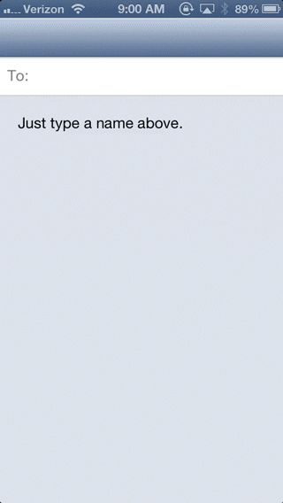

#  

[](http://cocoadocs.org/docsets/TURecipientBar)
[](http://cocoadocs.org/docsets/TURecipientBar)
[](http://cocoadocs.org/docsets/TURecipientBar)

`TURecipientBar` is a `UIView` for entering recipients similarly to the iOS Mail app. It handles search and display of recipients.

[](http://cl.ly/1h2Y3D0V3j2x)

## Installation

### [Cocoapods](http://cocoapods.org)

1. Add `pod TURecipientBar, '~> 2.0'` to your Podfile.
2. Run 'pod install'
3. Import `TURecipientsBar.h` and `TURecipientsDisplayController.h`.

### Manual

1. Copy the `TURecipientBar` subfolder into your project.
2. The only required framework is UIKit and iOS 6.0.
3. Import `TURecipientsBar.h` and `TURecipientsDisplayController.h`.

## Usage

> See the included example project and the [documentation](http://cocoadocs.org/docsets/TURecipientBar/).

`TURecipientBar` uses auto layout. This means that you will need to add constraints to it to position it. It will update it's height constraint automatically, and if you have your constraints setup properly, everything will adjust as needed.

Typically this means adding a constraint to the top, left, right and bottom of the bar. The bottom constraint will usually be a vertical spacing to another view.

If you are laying out your views in Interface Builder, ~~you will be forced to add constraints to make the layout non ambiguous. In this case, you can add a height constraint with a priority lower than 1000 (so that it isn't required) and connecting the `heightConstraint` IBOutlet.~~ In Xcode 5, you can now specify constraints as placeholders that will be removed a build time. Or, you can leave it off completely, but this will generate warnings.

For searching, you will need to create an instance of `TURecipientsDisplayController`. This class handles the logic of searching and displaying the search results. You then implement a `UITableViewDataSource` to show the search results and override `composeDisplayController:shouldReloadTableForSearchString:` to update the search results.

You need to connect the following outlets of the `TURecipientsDisplayController`:

- `recipientsBar`: The `TURecipientsBar`.
- `contentsController`: The view controller that the search results will be placed in. Almost always the view controller that the `recipientsBar` is in.
- `searchResultsDataSource`: The data source for the search table view.
- `searchResultsDelegate`: The delegate for the search table view. Usually the same as `searchResultsDataSource`.
- `recipientsBar.delegate`: Connect the `recipientsBar`'s delegate to the `TURecipientsDisplayController`.

You will also need to keep a reference to `TURecipientsDisplayController` or it will be deallocated.

**For iOS 7**, you will need to set `automaticallyAdjustsScrollViewInsets = NO` for the view controller the recipient bar is in. If you don't, it will cause the recipient bar (which is a subclass of `UIScrollView`) to behave erratically. I am looking into these issues to remove this requirement, and this may actually be a bug in iOS 7.

## Customization

### Hide the add button:

```  objective-c
self.recipientsBar.showsAddButton = NO;
```

### Add placeholder text:

```  objective-c
self.recipientsBar.placeholder = NSLocalizedString(@"Type names...", nil);
```

### Change the label's text:

```  objective-c
self.recipientsBar.label = @"Invite:";
```

### Disable search table view:

```  objective-c
- (BOOL)recipientsDisplayControllerShouldBeginSearch:(TURecipientDisplayController *)controller
{
	return NO;
}
```

### Change recipients appearance:

```  objective-c
UIImage *backgroundImage = [[UIImage imageNamed:@"token"] stretchableImageWithLeftCapWidth:14.0 topCapHeight:0.0];
[[TURecipientsBar appearance] setRecipientBackgroundImage:backgroundImage forState:UIControlStateNormal];
NSDictionary *attributes = @{
                             NSFontAttributeName: [UIFont fontWithName:@"American Typewriter" size:14.0],
                             NSForegroundColorAttributeName: [UIColor yellowColor],
                             };
[[TURecipientsBar appearance] setRecipientTitleTextAttributes:attributes forState:UIControlStateNormal];
```

### Change label appearance

```  objective-c
NSDictionary *labelAttributes = @{
                                  NSFontAttributeName: [UIFont fontWithName:@"Marker Felt" size:14.0],
                                  NSForegroundColorAttributeName: [UIColor redColor],
                                  };
[[TURecipientsBar appearance] setLabelTextAttributes:labelAttributes];
```
